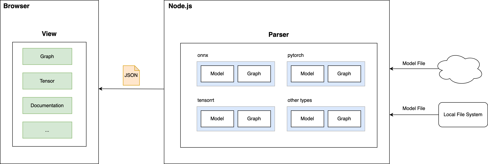

# Netron

The original document is [here](./README_ORIGIN.md).

## Project Introduction


You can use this Node.js tool to parse model and serialize the parsing result to JSON. Then you can use the serialized JSON for visualization in the browser.

## Usage
```
node source/node.js -d ./input/models -o ./dist/
```

- `-d`: The directory that contains the model files. This tool will search the specified directory and subdirectories recursively.
- `-o`: The output directory.

The outpu JSON file is in `gzip` format.

### View
You can start a web server to serve the resources in the `source` directory. Then load the `index.html` with the `url` param to specify the JSON file that is in gzip format.

Example:
```
cd source && python -m http.server
```
Open the url http://localhost:8000/?url=/model.onnx.json.gz

## Release branch

The `release` branch will follow the latest tag of [upstream](https://github.com/lutzroeder/netron).
